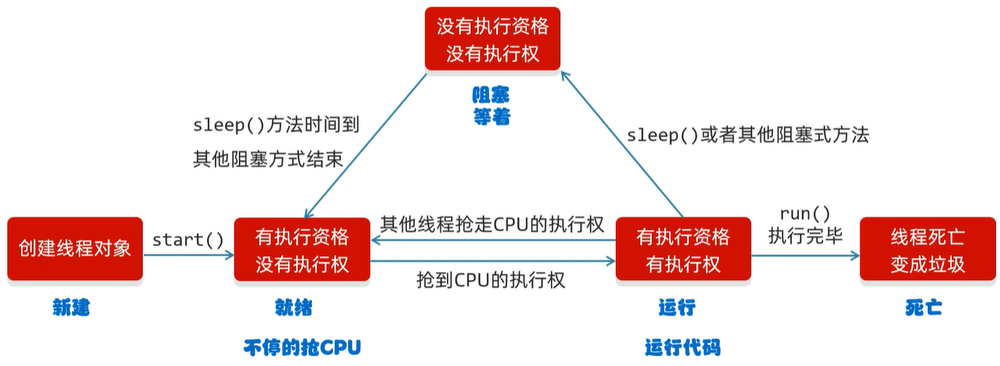
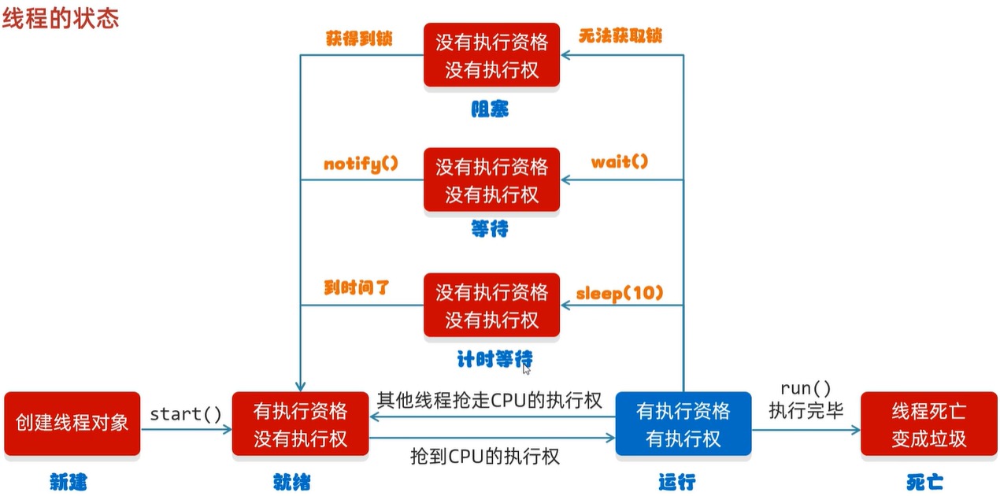

# myThreadMemo
並發：在同一時刻，有多個指令在單個CPU上交替執行。
並行：在同一時刻，有多個指令在多個CPU上同時執行。

實現方式
繼承 Thread 類並重寫 run 的方法：
* 優勢：在 run() 方法內獲取當前線程直接使用 this 就可以了，無須使用Thread.currentThread() 方法。
* 缺點：不能繼承其它類。任務和代碼不分離，多個線程執行一樣的任務時需要多份任務代碼（需要在run方法中寫同樣的代碼）。

實現 Runnable 接口的 run 方法，傳給 Thread ：
* 優勢：任務和代碼分離。可以繼承其他類。

實現Callable 接口的 call() 方法，傳給 FutureTask ：
* 優勢：擁有返回值。

---
* 分時調度模型：所有線程輪流使用 CPU 的使用權，平均分配每個線程占用 CPU 的時間片
* 搶占式調度模型：優先讓優先級高的線程使用CPU，如果線程的優先級相同，那麽會隨機選擇一個，優先級高的線程獲取的 CPU 時間片相對多一些

Java使用的是搶占式調度模型

---
守護線程：當其他非守護線程執行完畢後，守護線程會陸續結束、不會從頭到尾執行；應用場景可能是聊天室，聊天如果結束、傳輸到一半的文件也跟著結束

---
sleep()：由當前線程來休眠
yield()：出讓當前CPU的執行權
join()：插入到當前線程(main)之前



---
安全性
1. 同步代碼塊：鎖默認打開，有一個線程進去了即會關閉、塊中代碼執行完畢解鎖
```java=
synchronized(鎖(任意物件)) { 
	操作共享數據的代碼 
}
```
2. 同步方法：鎖住方法中的代碼，鎖對象不能自己指定；非靜態是this、靜態是當前類的字節碼物件(.class)
```java=
修飾符 static synchronized 返回值類型 方法名(方法參數) { 
	方法體；
}
```
3. Lock鎖：為了更清晰的表達如何加鎖和釋放鎖，JDK5以後提供了一個新的鎖對象Lock；Lock是接口不能直接實例化，使用實現類ReentrantLock來實例化

死鎖：由於兩個或者多個線程互相持有對方所需要的資源，導致這些線程處於等待狀態，無法前往執行；什麽情況下會產生死鎖，資源有限、同步嵌套

---
生產者消費者問題，實際上主要是包含了兩類線程：
1. 生產者線程用於生產數據
2. 是消費者線程用於消費數據

為了解耦生產者和消費者的關係，通常會採用共享的數據區域，就像是一個倉庫。生產者生產數據之後直接放置在共享數據區中，並不需要關心消費者的行為；消費者只需要從共享數據區中去獲取數據，並不需要關心生產者的行為
* void wait()：當前線程等待，直到被其他線程喚醒
* void notify()：隨機喚醒單個線程
* void notifyAll()：喚醒所有線程

---
阻塞隊列BlockingQueue基本使用，常見以下兩者：
* ArrayBlockingQueue: 底層是數組，有界
* LinkedBlockingQueue: 底層是鏈表，無界；但不是真正的無界、最大為int的最大值

BlockingQueue的核心方法：
* put(anObject)：將參數放入隊列，如果放不進去會阻塞
* take()：取出第一個數據，取不到會阻塞

---
線程的六種狀態

1. NEW：創建了線程而未調用start方法
2. RUNNABLE：線程得到了CPU的分片處於運行狀態
3. BLOCKED：當線程去申請其他線程已經在使用的獨占鎖時，會處於這一狀態
4. WAITING：調用wait、join等方法時，會進入到這一狀態
5. TIMED_WAITING：與WAITING類似，只不過不是無限制的等待，如sleep()
6. TERMINATED：執行結束的線程處於這一狀態


